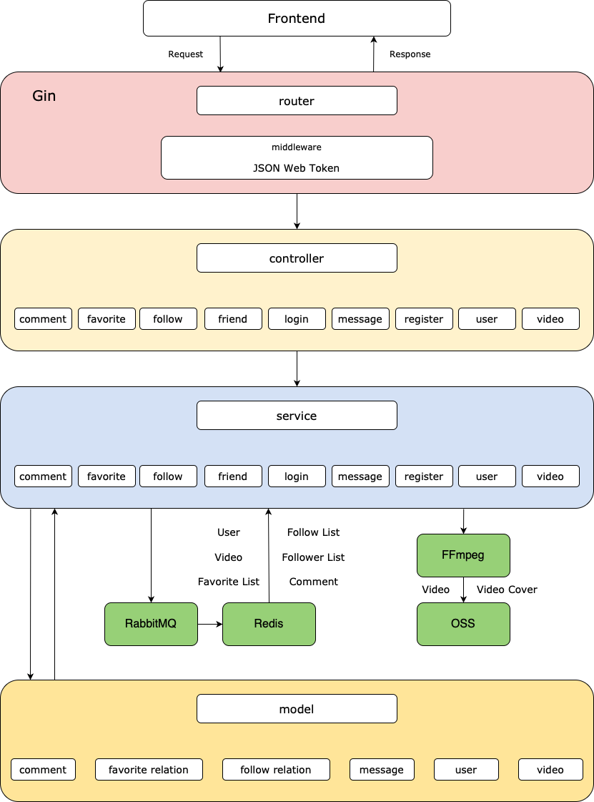

# Tiny-Tiktok


[](https://github.com/Ghjattu/tiny-tiktok/actions/workflows/go.yml)

[](https://codecov.io/gh/Ghjattu/tiny-tiktok)

[](https://goreportcard.com/report/github.com/Ghjattu/tiny-tiktok)


Tiny-Tiktok 是一个基于 Golang 的极简版抖音后端，用户可以在平台上发布短视频，也可以观看其他用户发布的短视频。本项目基于 Gin 框架，使用了 MySQL、Redis、RabbitMQ 和阿里云 OSS 等技术，实现了用户注册、登录、视频上传、视频点赞、视频评论、关注用户、发送消息等功能。

[青训营大项目答辩汇报文档](https://v1e4jqvg2bf.feishu.cn/docx/IoPkdB4T5oxWg1xxH4Hct0HTnDd?from=from_copylink)

## Development Environment
- OS: Ubuntu 20.04 & macOS
- Golang: 1.20.7
- MySQL: 8.0.33
- Redis: 7.0.12
- RabbitMQ: 3.8.2

## Get Started
### Download Dependencies
```go
cd tiny-tiktok
go mod download
```

### Environment Variables
在项目根目录下创建 `.env` 文件，变量列表如下：
#### 阿里云OSS
- `OSS_BUCKET_NAME`（必需）: 阿里云 OSS 的 Bucket 名称
- `OSS_ENDPOINT`（必需）: 阿里云 OSS 的 Endpoint(地域节点)
- `OSS_ACCESS_KEY_ID`（必需）: 阿里云的 AccessKey ID
- `OSS_ACCESS_KEY_SECRET`（必需）: 阿里云的 AccessKey Secret
#### MySQL
- `MYSQL_USERNAME`（可选）: MySQL 的用户名，默认为 `root`
- `MYSQL_PASSWORD`（可选）: MySQL 的密码，默认为空
- `MYSQL_IP`（可选）: MySQL 的 IP，默认为 `127.0.0.1`
- `MYSQL_PORT`（可选）: MySQL 的端口，默认为 `3306`
- `MYSQL_DB_NAME`（可选）: MySQL 的数据库名，默认为 `tiktok`
- `MYSQL_DB_NAME_TEST`（可选）: MySQL 的测试数据库名，默认为 `tiktok_test`
#### JSON Web Token
- `SECRET_KEY`（可选）: JWT 签名的密钥，默认为 `secret-key`
- `TOKEN_LIFESPAN`（可选）: 整数，表示 JWT 的有效期，单位为小时，默认为 `24`
#### Redis
- `REDIS_IP`（可选）: Redis 的 IP，默认为 `127.0.0.1`
- `REDIS_PORT`（可选）: Redis 的端口，默认为 `6379`
- `REDIS_PASSWORD`（可选）: Redis 的密码，默认为空
#### RabbitMQ
- `RABBITMQ_USERNAME`（可选）: RabbitMQ 的用户名，默认为 `guest`
- `RABBITMQ_PASSWORD`（可选）: RabbitMQ 的密码，默认为 `guest`
- `RABBITMQ_IP`（可选）: RabbitMQ 的 IP，默认为 `127.0.0.1`
- `RABBITMQ_PORT`（可选）: RabbitMQ 的端口，默认为 `5672`

### Run
```go
cd tiny-tiktok
go run main.go
```

### Test
可以选择在项目根目录下运行该项目中的所有测试：
```go
cd tiny-tiktok
go test -v -p 1 -race ./...
```
或者只运行某个包下的测试，例如运行 `controllers` 包下的测试：
```go
cd tiny-tiktok/controllers
go test -v -race
```

### Continuous Integration
本项目使用了 GitHub Actions 和 Codecov 进行持续集成和代码测试覆盖率的生成，如果你想使用此功能，你需要：
1. 根据 Codecov 官方的 [Quick Start](https://docs.codecov.com/docs) 配置好仓库的 `CODECOV_TOKEN`。

2. 配置阿里云 OSS 的环境变量：
	1. 在仓库主页，点击上方菜单栏中的 **Settings**。
	2. 在左侧菜单栏中，点击 **Environments**。
	3. 点击右上角的 **New environment**，输入环境名称，例如 `test`，然后点击 **Configure environment**。
	4. 进入刚才创建的环境，在 **Environment secrets** 这一栏中点击 **Add secret**，输入变量的名称和值，包括四个变量：`OSS_BUCKET_NAME`、`OSS_ENDPOINT`、`OSS_ACCESS_KEY_ID`、`OSS_ACCESS_KEY_SECRET`。

3. 创建一个工作流：
	1. 在仓库主页，点击上方菜单栏中的 **Actions**。

	2. 可以直接选择官方提供的 Go 语言模版，点击 **Configure**。

	3. 在生成的 `go.yml` 文件中添加下面的内容：
		```yaml
		runs-on: ubuntu-latest
		environment:
		  name: <your-environment-name>
		env:
		  OSS_BUCKET_NAME: ${{ secrets.OSS_BUCKET_NAME }}
		  OSS_ENDPOINT: ${{ secrets.OSS_ENDPOINT }}
		  OSS_ACCESS_KEY_ID: ${{ secrets.OSS_ACCESS_KEY_ID }}
		  OSS_ACCESS_KEY_SECRET: ${{ secrets.OSS_ACCESS_KEY_SECRET }}
		```
	4. 在 [Marketplace](https://github.com/marketplace?type=actions) 中选择相应的 MySQL、Redis 和 RabbitMQ 插件并在 `go.yml` 文件中添加相应的配置，同时在 `env:` 中添加相应的环境变量使其能够被程序代码中的 `os.Getenv()` 函数获取到。
	5. 在 `name: Test` 这一步中将代码修改为：
		```yaml
		- name: Test
          run: go test -v -p 1 -race -coverprofile=coverage.txt -covermode=atomic ./...
		```
	6. 最后，将覆盖率报告上传到 Codecov：
		```yaml
		- name: Upload coverage reports to Codecov
		  uses: codecov/codecov-action@v3
		  env:
		    CODECOV_TOKEN: ${{ secrets.CODECOV_TOKEN }}
		```
一旦你完成了上述步骤，GitHub Actions 工作流将在每次推送到主分支时自动触发。你可以在 GitHub 仓库的 Actions 标签页中查看工作流的运行情况，以及在 Codecov 平台上查看生成的代码覆盖率报告。


## Architecture
